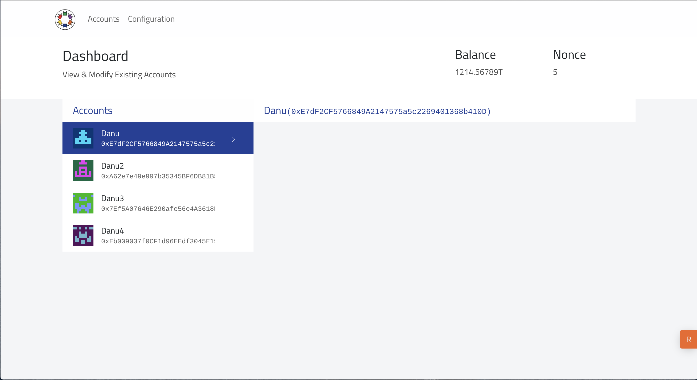
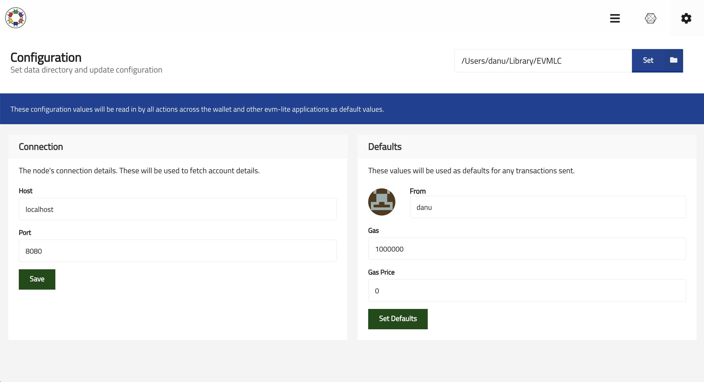

# Monet Wallet

A user interface to interact with Monet.

## Preview





## Development

To build and run Monet Wallet, download / clone this repository, then simply follow the instructions below.

You will need to install `yarn` to proceed to development.

```bash
curl -o- -L https://yarnpkg.com/install.sh | bash
```

To install dependencies

```bash
yarn install
```

This should also transpile all `ts` and `tsx` files.

You can run the development environment by

```bash
yarn run dev
```

This should start up a development server for hot-reloading and an electron window to view the app.
